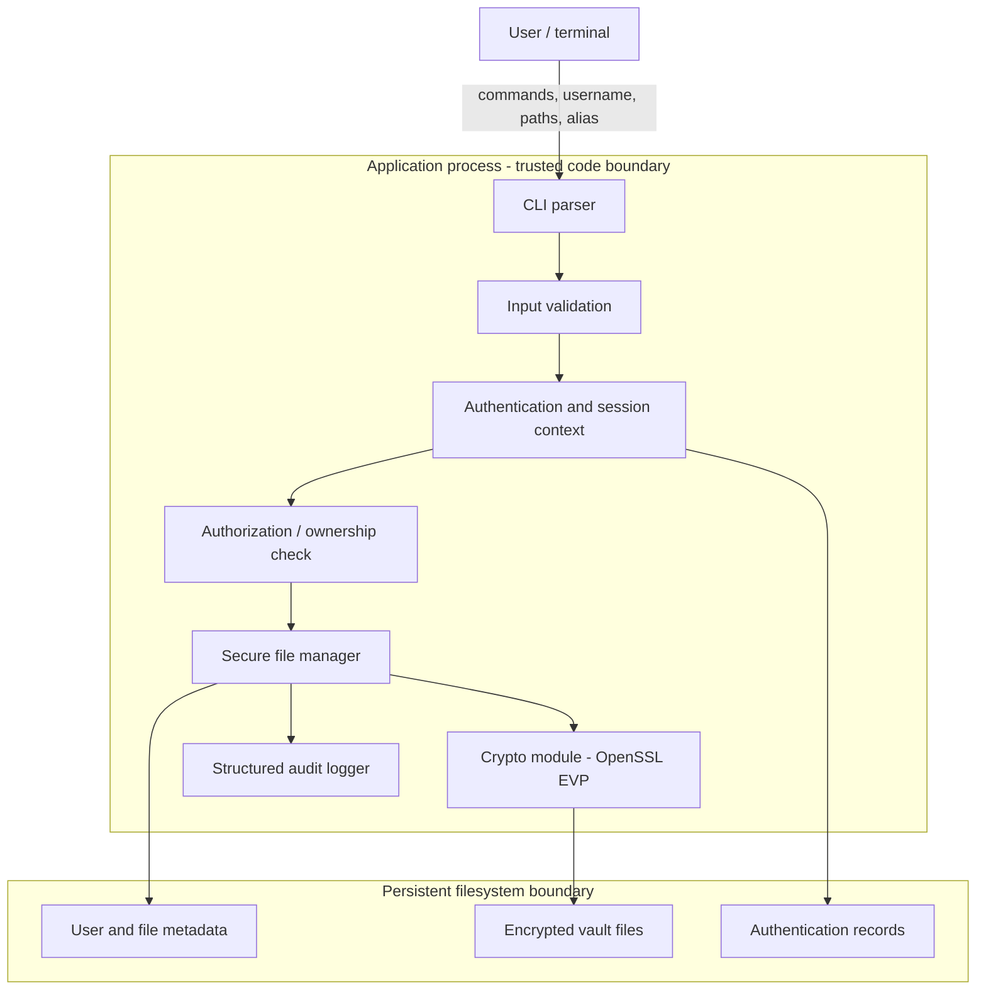

# Checkpoint 1 — Threat Model and Architecture

**Course:** ICS0022 Secure Programming  
**Project:** Secure File Encryption and Management System  
**Implementation language:** C17  
**Primary security library:** OpenSSL 3.x  

## 1. Purpose and scope

The application is a local command-line tool that allows authenticated application users to store files in encrypted form, list their own stored files, decrypt them to an explicitly selected output path, and delete stored files.

Checkpoint 1 is a design checkpoint. This document defines the system boundaries, data flow, assets, trust assumptions, threats, and planned mitigations before implementing security-sensitive code.

### In scope

- local user authentication;
- per-user ownership of stored files and metadata;
- authenticated encryption of stored files;
- secure file opening/creation patterns;
- input validation for usernames, aliases, paths, and file metadata;
- safe memory handling for passwords, keys, and buffers;
- structured security-relevant logging without secrets;
- generic user-facing error handling.

### Out of scope

- network access or remote clients;
- cloud synchronization;
- a graphical interface;
- protection against a fully compromised operating-system kernel/root administrator while the process is running;
- guaranteed physical erasure of data from SSD/flash media, copy-on-write filesystems, snapshots, or backups.

The last limitation matters: the project can securely remove the application's logical encrypted object and avoid unnecessary plaintext copies, but software above the filesystem cannot guarantee physical media sanitization on modern storage.

## 2. Security objectives and assets

Main assets:

1. **Plaintext file contents** — confidential except during an authorized decrypt operation.
2. **User passwords** — never stored or logged in plaintext.
3. **Derived encryption keys** — exist only in process memory for the minimum necessary time.
4. **Authentication verifier data** — stored only in salted, deliberately expensive-to-guess form.
5. **Encrypted vault files** — confidentiality and integrity protected.
6. **Ownership metadata** — prevents one application user from operating on another user's records.
7. **Audit log** — useful security events without passwords, keys, tokens, or plaintext contents.
8. **File metadata and aliases** — validated so they cannot become filesystem-control input.

Security objectives:

- confidentiality of stored contents;
- integrity/authenticity of encrypted objects;
- authentication before protected operations;
- authorization on every record/file operation;
- least privilege at the filesystem level;
- fail-safe behavior on malformed input, I/O failure, or authentication failure;
- no secret leakage through command-line arguments, logs, or normal error messages.

## 3. Actors and trust assumptions

### Actors

- **Legitimate application user:** knows their username/password and uses the CLI as intended.
- **Malicious application user:** has a valid account but attempts to access another user's records or exploit input/file-handling behavior.
- **Local unprivileged process/user:** may manipulate filesystem objects that the current OS account can access.
- **Offline attacker:** obtains a copy of the application data directory and attempts to recover passwords or plaintext.

### Trust assumptions

- OpenSSL cryptographic primitives and OS cryptographic randomness are trusted dependencies.
- The operating-system kernel is trusted while the program executes.
- A root/administrator attacker, sufficiently privileged debugger, or compromised kernel can read process memory; preventing that is outside the project boundary.
- Application users are not necessarily separate OS users, so the application must enforce ownership itself; filesystem permissions provide defense in depth.

## 4. System architecture



### Components

**CLI parser**  
Accepts only documented commands. Passwords are read interactively with terminal echo disabled and never accepted through `argv`.

**Input validation**  
Validates usernames, aliases, argument counts, lengths, file types, and command syntax. User-provided aliases are data, not filesystem paths.

**Authentication and session context**  
Loads the selected user's authentication record, derives a verifier from the entered password, compares it in constant time, and creates an authenticated in-memory session context on success.

**Authorization / ownership check**  
Every list/decrypt/delete operation checks that the record belongs to the authenticated application user. Authorization is performed on every protected operation, not only once at login.

**Secure file manager**  
Owns file-descriptor-based input/output, vault naming, safe creation, atomic replacement where needed, metadata updates, and cleanup after failure.

**Crypto module**  
Uses OpenSSL EVP APIs; no custom cryptographic primitive is implemented.

**Structured audit logger**  
Records event type, user/session identifier, timestamp, source=`local`, and outcome. It never records passwords, derived keys, plaintext content, or authentication tokens.

## 5. Data flow and trust boundaries

### TB1 — terminal/user input -> application

All command names, usernames, aliases, and filesystem paths are untrusted. They must be parsed with explicit length/format checks before they influence storage or file operations.

### TB2 — authenticated application user -> another user's objects

Authentication does not imply global authorization. Each stored record has an owner identifier, and every file operation must confirm ownership.

### TB3 — application process -> filesystem

Filesystem names and objects can change asynchronously. Security decisions must therefore use opened file descriptors and post-open metadata checks rather than check-then-open patterns wherever possible.

### TB4 — transient secrets -> persistent storage

Plaintext passwords and derived encryption keys must not cross this boundary. Only salted verifier/KDF parameters, nonces, authentication tags, ciphertext, and non-secret metadata may be persisted.

## 6. Planned persistent layout

```text
~/.securefm/                 mode 0700
├── users.db                 mode 0600
├── audit.log                mode 0600
└── vault/                   mode 0700
    └── <owner-id>/          mode 0700
        ├── index.db         mode 0600
        └── <random-id>.sfm  mode 0600
```

Aliases are never used directly as vault filenames. Internal ciphertext objects use application-generated random identifiers.

A user record is expected to contain at least:

- normalized username;
- stable owner identifier;
- authentication salt;
- password verifier;
- separate encryption-KDF salt;
- KDF algorithm/parameters/version.

It must never contain the plaintext password or a plaintext encryption key.

## 7. Planned cryptographic design

### Password authentication

1. Read the password interactively with terminal echo disabled.
2. Load the user's random authentication salt and stored KDF parameters.
3. Derive an authentication verifier using **PBKDF2-HMAC-SHA256** through OpenSSL.
4. Compare the derived verifier with the stored verifier using a constant-time comparison such as `CRYPTO_memcmp()`.
5. Return one generic authentication error for invalid username and invalid password to reduce username enumeration.

The iteration count will be stored with the user record and finalized by benchmarking during implementation.

### File encryption key

After successful authentication, derive a separate 256-bit encryption key from the password using a **different random salt** (and/or explicit derivation context) from the authentication verifier. The derived key exists only in process memory during the operation/session and is wiped before release.

### File encryption

- Algorithm: **AES-256-GCM** via OpenSSL EVP.
- Key: 256 bits.
- Nonce/IV: fresh random 96-bit value generated for every encryption with `RAND_bytes()`.
- Authentication tag: 128 bits.
- Relevant header fields will be authenticated as Additional Authenticated Data (AAD).
- A nonce must never be reused with the same AES-GCM key.

The encrypted file contains only non-secret format information, nonce, ciphertext, and authentication tag.

### Decryption failure rule

GCM authentication must succeed before decrypted data is treated as valid output. The implementation must avoid leaving a partially written plaintext output file after tag verification or another fatal error fails.

### Secret cleanup

Password buffers, derived keys, and other sensitive temporary buffers will be cleared with a secure-cleansing API such as `OPENSSL_cleanse` before release. Extra secret copies should be minimized.

## 8. Secure file-I/O design

### Source file for encryption

Planned sequence:

1. `open()` source read-only with `O_CLOEXEC` and, where available, `O_NOFOLLOW`.
2. `fstat()` the returned descriptor.
3. Require a regular file using `S_ISREG()`.
4. Apply a configured size limit before allocation/processing.
5. Read from the same descriptor that was validated.

This avoids a classic `check(path) -> attacker replaces path -> open(path)` TOCTOU pattern.

### Vault files

- Vault filenames are generated internally, not from aliases.
- New objects use exclusive creation semantics (`O_CREAT | O_EXCL`) and mode `0600`.
- Private application/vault directories use mode `0700`.
- A restrictive `umask` is set during sensitive creation.
- Internal operations should prefer directory-relative APIs such as `openat()`.

### Decrypted output

The program does not silently overwrite an existing destination. Output creation uses exclusive creation and rejects final-component symlinks where supported.

### Temporary files

- Do not create plaintext temporary files for encryption.
- If decryption requires staging, create the temporary file privately in the destination directory with mode `0600`, then atomically rename only after successful GCM tag verification.
- Clean up temporary artifacts on every error path.

## 9. Threat model

| ID | Area / asset | Threat | Planned mitigation | Residual risk / verification |
|---|---|---|---|---|
| T01 | CLI / paths | Path traversal reaches unintended internal storage | Never use alias as a vault path; generated IDs; controlled vault directory; validate path-bearing arguments | User-chosen source/output paths remain intentionally external. Test traversal-like aliases. |
| T02 | Filesystem | Symlink redirects a sensitive file operation | `O_NOFOLLOW` where available; `openat()`; post-open `fstat()`; generated internal names | Parent-directory attacks depend on OS permissions. Test symlink source/destination. |
| T03 | Filesystem | TOCTOU between pathname validation and use | Open first, then validate same fd with `fstat()`; avoid `access()/stat()` followed by second open for authorization | Review all security-sensitive opens. |
| T04 | File input | FIFO/device/socket supplied as input | Require regular files with `S_ISREG()` after open | Test FIFO, symlink, and directory rejection. |
| T05 | Output | Existing file accidentally overwritten | `O_CREAT | O_EXCL`; explicit failure if destination exists | Force-overwrite is out of initial scope. |
| T06 | Stored data | Broad permissions expose metadata/logs/ciphertext | Directories `0700`; files `0600`; restrictive `umask` | OS administrator/root is out of scope. |
| T07 | Authentication | Offline password guessing after theft of `users.db` | Unique random salt; PBKDF2-HMAC-SHA256; versioned configurable cost | Weak user passwords remain guessable. |
| T08 | Authentication | Username enumeration via different errors | Same generic message for unknown user and wrong password | Timing equivalence is not formally proven. |
| T09 | Password | Password leaks via process list/shell history | Never accept password in argv/env/config; interactive no-echo input | Privileged memory inspection is out of scope. |
| T10 | Ownership | User accesses another user's file through alias/ID manipulation | Stable owner ID; authorization on every list/decrypt/delete operation | Direct OS access to ciphertext may still be possible for same OS account. |
| T11 | Crypto | Weak randomness or AES-GCM nonce reuse | `RAND_bytes()`; fresh 96-bit nonce per encryption; fail closed on RNG failure | Catastrophic RNG/OS compromise is outside app control. |
| T12 | Ciphertext | Attacker modifies ciphertext/header | AES-256-GCM tag verification; authenticate relevant header fields as AAD | Rollback to an older valid ciphertext is not prevented; anti-rollback is out of initial scope. |
| T13 | Decryption | Failed authentication leaves partial plaintext | Private staging; publish only after tag verification; unlink temp on failure | Crash recovery must clean stale temp files. |
| T14 | Memory | Password/key remains in memory after use | Minimize copies; explicit cleanse; prompt release | Paging/crash dumps are not fully controlled by this project. |
| T15 | Parser / memory | Malformed metadata or huge length causes overflow/out-of-bounds allocation | Checked conversions, explicit maxima, reject inconsistent metadata | Verify with sanitizers/static analysis/boundary tests. |
| T16 | Logging | Password/key/plaintext leaks into logs | Structured allow-list fields only; never pass secret buffers to logger | Add negative tests and review call sites. |
| T17 | Deletion | Deleted data remains physically recoverable | Delete logical encrypted object; avoid plaintext temps; wipe in-memory secrets; document storage limitation | Physical erasure on SSD/COW/snapshots cannot be guaranteed. |

## 10. Input-validation rules

Initial rules:

- **Username:** normalized ASCII identifier with explicit length bounds; no path separators or control characters.
- **Alias:** user-visible label with explicit length/character policy; metadata only, never an internal path component.
- **Source path:** OS path chosen by authenticated user, opened safely, then validated through descriptor metadata.
- **Output path:** created without silent overwrite and without following a final symlink where supported.
- **Numeric lengths:** checked conversion and upper bounds before allocation.
- **Encrypted file header:** exact magic/version/length validation before use.

Sanitization is not a substitute for validation. The design prefers a small accepted grammar and safe APIs over trying to delete dangerous characters after the fact.

## 11. Logging and error handling

Planned structured fields:

```text
timestamp=<UTC time> event=<event> user=<id-or-unknown> session=<id> source=local outcome=<success|failure>
```

Logs must not contain plaintext passwords, verifier material, derived keys, plaintext file contents, or encryption keys.

## 12. Implementation language and libraries

### C17

C is retained because the course emphasizes secure memory handling, bounds, file I/O, and error management. It keeps security-relevant implementation choices visible.

### OpenSSL 3.x

OpenSSL provides established cryptographic primitives and CSPRNG functionality. The implementation will use the high-level EVP interface rather than implement cryptography manually.

### POSIX file APIs

`open`, `openat`, `fstat`, descriptor-based reads/writes, restrictive modes, and atomic rename patterns provide the control needed to reason about symlink, overwrite, and TOCTOU risks.

## 13. Checkpoint-to-final roadmap

### Checkpoint 1 — current

- architecture and data flow;
- trust boundaries and assets;
- threat model and intended mitigations;
- C/OpenSSL/POSIX design decision;
- initialized repository, README, Makefile, CLI skeleton.

### Checkpoint 2

- command parser;
- create-user/authentication;
- AES-256-GCM encrypt/decrypt through OpenSSL EVP;
- basic per-user metadata and ownership checks;
- first-level validation;
- reproducible build/run instructions.

### Checkpoint 3

- sensitive memory cleanup audit;
- traversal/symlink/TOCTOU hardening;
- structured logging and generic errors;
- authorization on every record operation;
- automated functional and negative/security tests;
- compiler warnings, sanitizers, and static analysis;
- report draft and threat-model re-review.

## 14. Verification plan derived from the threat model

Final tests should include:

- encrypt/decrypt round trip;
- modified ciphertext/tag rejection;
- wrong-password and unknown-user failure paths;
- cross-user access denial;
- traversal-like aliases;
- symlink and non-regular input rejection;
- destination-existing failure;
- malformed/truncated encrypted header;
- oversized input/length boundary cases;
- failed decrypt leaves no plaintext artifact;
- log review proving passwords/keys/plaintext are absent;
- AddressSanitizer/UndefinedBehaviorSanitizer runs;
- static-analysis review.

## 15. Relationship to the course readings

The ICS0022 project specification defines mandatory product/checkpoint requirements. The supplied SDL, SSDLC, OWASP SAMM, DevSecOps, and static-analysis readings are used as engineering guidance rather than as extra mandatory product features.

For this project the useful ideas are: define security requirements early, decompose the system, identify trust boundaries/assets, model threats before coding, reduce attack surface, use approved cryptographic libraries, avoid unsafe APIs, keep changes version controlled, perform static/dynamic analysis, and turn identified threats into tests.

Enterprise-only machinery such as organization-wide maturity scoring, SIEM/SOAR integration, large governance structures, deployment platforms, and multi-team approval workflows is intentionally not copied into this student CLI project.
